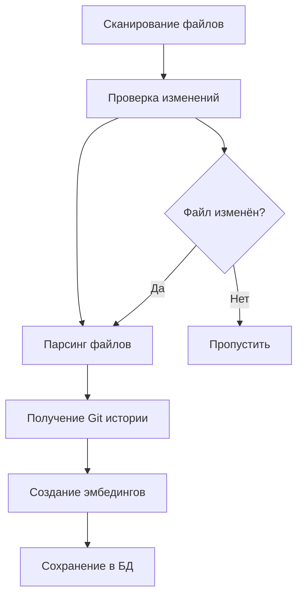

# GoKB Embedder

> 🚀 **Универсальный генератор эмбедингов для кодовых баз**  
> Создавайте векторные представления вашего кода для семантического поиска и интеграции с LLM

[](https://golang.org)
[](LICENSE)
[]()

## 📋 Содержание

- [🎯 Что это такое?](#-что-это-такое)
- [⚡ Быстрый старт](#-быстрый-старт)
- [🔧 Установка и настройка](#-установка-и-настройка)
- [📚 Документация](#-документация)
- [🏗️ Архитектура](#️-архитектура)
- [🎯 Возможности](#-возможности)
- [📊 Структура проекта](#-структура-проекта)
- [🔍 Как это работает](#-как-это-работает)
- [📝 Примеры использования](#-примеры-использования)
- [🔧 Расширение функциональности](#-расширение-функциональности)
- [🐛 Устранение неполадок](#-устранение-неполадок)
- [🤝 Вклад в проект](#-вклад-в-проект)

## 🎯 Что это такое?

**GoKB Embedder** — это инструмент для создания векторных представлений (эмбедингов) из кодовой базы проекта. Он сканирует ваш код, извлекает логические блоки и создаёт эмбединги через OpenAI API для последующего семантического поиска.

### 🎯 Основные возможности

- **🔍 Умное сканирование** — автоматическое игнорирование файлов по `.gitignore`
- **📝 Парсинг кода** — извлечение методов, функций и документации
- **🔄 Умное обновление** — пересоздание эмбедингов только для изменённых файлов
- **📚 Git интеграция** — добавление истории коммитов к каждому блоку
- **🏗️ Модульная архитектура** — легко добавлять новые парсеры
- **⚡ Высокая производительность** — оптимизированная обработка больших проектов

## ⚡ Быстрый старт

### 🚀 Интерактивный режим (по умолчанию)

```bash
# Скачайте исполняемый файл для вашей системы
# Linux/macOS
chmod +x gokb-embedder-linux-amd64
./gokb-embedder-linux-amd64

# Windows
gokb-embedder-windows-amd64.exe
```

**🎯 Интерактивный CLI проведёт вас через весь процесс настройки!**

### ⚡ Быстрый режим (без интерфейса)

```bash
# Запуск с существующим .env файлом
./gokb-embedder-linux-amd64 --quick
```

**🚀 Для автоматизации и CI/CD процессов**

### 📋 Доступные версии

| Платформа | Архитектура | Файл | Размер |
|-----------|-------------|------|--------|
| **Linux** | AMD64 | `gokb-embedder-linux-amd64` | ~12 МБ |
| **Linux** | ARM64 | `gokb-embedder-linux-arm64` | ~8 МБ |
| **Windows** | AMD64 | `gokb-embedder-windows-amd64.exe` | ~8.8 МБ |
| **macOS** | Intel | `gokb-embedder-darwin-amd64` | ~8.5 МБ |
| **macOS** | Apple Silicon | `gokb-embedder-darwin-arm64` | ~8 МБ |

### 🔧 Ручная настройка

Если предпочитаете ручную настройку:

```bash
# Создайте файл конфигурации
cat > .env << EOF
OPENAI_API_KEY=your_openai_api_key_here
ROOT_DIR=.
FILE_EXTENSIONS=.py,.js,.md,.yml,.conf
DB_PATH=embeddings.sqlite3
N_COMMITS=3
TOKEN_LIMIT=1600
LOG_LEVEL=info
EOF

# Запустите в быстром режиме
./gokb-embedder-linux-amd64 --quick
```

**🎉 Готово!** Ваши эмбединги сохранены в `embeddings.sqlite3`

📖 **Подробнее**: [QUICKSTART.md](QUICKSTART.md) — полная инструкция по быстрому старту

## 🔧 Установка и настройка

### 📋 Требования

- **Go 1.21+** (только для разработки)
- **SQLite3** (встроен в исполняемый файл)
- **OpenAI API ключ** (для создания эмбедингов)
- **Git** (опционально, для истории коммитов)

### 🛠️ Для разработчиков

Если вы хотите собрать проект из исходного кода:

```bash
# Клонируем репозиторий
git clone https://github.com/367300/gokb-embedder.git
cd gokb-embedder

# Устанавливаем зависимости
go mod tidy

# Собираем приложение
make build

# Или для всех платформ
make build-all
```

📖 **Подробнее**: [docs/BUILD_INSTRUCTIONS.md](docs/BUILD_INSTRUCTIONS.md) — полные инструкции по сборке

### ⚙️ Конфигурация

#### Переменные окружения

| Переменная | Описание | По умолчанию | Обязательно |
|------------|----------|--------------|-------------|
| `OPENAI_API_KEY` | Ключ OpenAI API | - | ✅ |
| `ROOT_DIR` | Корневая директория для поиска файлов | `.` | ❌ |
| `FILE_EXTENSIONS` | Расширения файлов для обработки | `.py,.js,.md,.yml,.conf` | ❌ |
| `DB_PATH` | Путь к файлу базы данных | `embeddings.sqlite3` | ❌ |
| `N_COMMITS` | Количество последних коммитов | `3` | ❌ |
| `TOKEN_LIMIT` | Лимит токенов на блок | `1600` | ❌ |
| `LOG_LEVEL` | Уровень логирования | `info` | ❌ |

#### Способы настройки

1. **Файл .env** (рекомендуется):
   ```bash
   cp env.example .env
   nano .env
   ```

2. **Переменные окружения**:
   ```bash
   OPENAI_API_KEY=your_key ROOT_DIR=/path/to/project ./gokb-embedder
   ```

3. **Командная строка** (в разработке):
   ```bash
   ./gokb-embedder --config=/path/to/config.yaml
   ```

## 📚 Документация

### 📖 Основные документы

| Документ | Описание | Для кого |
|----------|----------|----------|
| **[QUICKSTART.md](QUICKSTART.md)** | 🚀 Быстрый старт за 5 минут | Все пользователи |
| **[docs/CLI_INTERFACE.md](docs/CLI_INTERFACE.md)** | 🖥️ Интерактивный CLI интерфейс | Все пользователи |
| **[docs/BUILD_INSTRUCTIONS.md](docs/BUILD_INSTRUCTIONS.md)** | 🛠️ Сборка и развёртывание | Разработчики |
| **[docs/ARCHITECTURE.md](docs/ARCHITECTURE.md)** | 🏗️ Архитектура проекта | Разработчики |
| **[docs/COMPARISON.md](docs/COMPARISON.md)** | 📊 Сравнение с Python версией | Архитекторы |

### 📋 Справочники

- **[Структура базы данных](#-структура-базы-данных)** — схема SQLite
- **[Примеры использования](#-примеры-использования)** — SQL запросы
- **[Устранение неполадок](#-устранение-неполадок)** — решение проблем
- **[Расширение функциональности](#-расширение-функциональности)** — добавление парсеров

### 🎯 Навигация по проекту

- **Новичок?** → [QUICKSTART.md](QUICKSTART.md)
- **Хотите собрать из исходников?** → [docs/BUILD_INSTRUCTIONS.md](docs/BUILD_INSTRUCTIONS.md)
- **Изучаете архитектуру?** → [docs/ARCHITECTURE.md](docs/ARCHITECTURE.md)
- **Есть проблемы?** → [Устранение неполадок](#-устранение-неполадок)
- **Хотите добавить парсер?** → [Расширение функциональности](#-расширение-функциональности)

## 🏗️ Архитектура

Проект построен по принципам чистой архитектуры с чётким разделением ответственности:

```
gokb-embedder/
├── cmd/                    # 🚀 Точка входа
│   └── main.go
├── internal/               # 🔧 Внутренние модули
│   ├── app/               # 🎯 Основная логика приложения
│   ├── config/            # ⚙️ Конфигурация
│   ├── database/          # 💾 Работа с SQLite
│   ├── git/               # 📚 Git интеграция
│   ├── models/            # 📋 Модели данных
│   ├── openai/            # 🤖 OpenAI API клиент
│   ├── parsers/           # 📝 Парсеры файлов
│   ├── scanner/           # 🔍 Сканирование файлов
│   └── utils/             # 🛠️ Утилиты
├── docs/                  # 📚 Документация
├── examples/              # 💡 Примеры
└── build/                 # 📦 Исполняемые файлы
```

### 🎯 Ключевые компоненты

| Модуль | Назначение | Файлы |
|--------|------------|-------|
| **app** | Координация всех компонентов | `app.go` |
| **config** | Загрузка конфигурации | `config.go`, `errors.go` |
| **database** | Работа с SQLite | `database.go` |
| **git** | Git интеграция | `git.go` |
| **models** | Структуры данных | `codeblock.go` |
| **openai** | OpenAI API | `openai.go` |
| **parsers** | Парсеры файлов | `parser.go`, `python_parser.go`, `text_parser.go` |
| **scanner** | Сканирование файлов | `scanner.go` |
| **utils** | Вспомогательные функции | `tokenizer.go` |

📖 **Подробнее**: [docs/ARCHITECTURE.md](docs/ARCHITECTURE.md) — детальное описание архитектуры

## 🎯 Возможности

### 🔍 Поддерживаемые форматы

| Тип файла | Расширения | Парсер | Описание |
|-----------|------------|--------|----------|
| **Python** | `.py` | Python Parser | Методы, функции, классы |
| **JavaScript** | `.js`, `.jsx`, `.ts`, `.tsx` | JavaScript Parser | Функции, методы, классы, стрелочные функции |
| **Markdown** | `.md` | Text Parser | Документация, README |
| **YAML** | `.yml`, `.yaml` | Text Parser | Конфигурации, CI/CD |
| **Config** | `.conf`, `.config` | Text Parser | Настройки приложений |
| **Text** | `.txt` | Text Parser | Простые текстовые файлы |

### 🚀 Ключевые функции

- **🖥️ Интерактивный CLI** — красивый интерфейс для настройки
- **🔍 Умное сканирование** — автоматическое игнорирование по `.gitignore`
- **📝 Структурированный парсинг** — извлечение логических блоков кода
- **🔄 Инкрементальное обновление** — только изменённые файлы
- **📚 Git интеграция** — история коммитов для каждого блока
- **🏗️ Расширяемая архитектура** — легко добавлять новые парсеры
- **⚡ Высокая производительность** — оптимизированная обработка

## 📊 Структура проекта

### 📁 Организация файлов

```
gokb-embedder/
├── cmd/                    # 🚀 Точка входа
├── internal/               # 🔧 Основной код
│   ├── app/               # 🎯 Логика приложения
│   ├── config/            # ⚙️ Конфигурация
│   ├── database/          # 💾 База данных
│   ├── git/               # 📚 Git интеграция
│   ├── models/            # 📋 Модели данных
│   ├── openai/            # 🤖 OpenAI API
│   ├── parsers/           # 📝 Парсеры
│   ├── scanner/           # 🔍 Сканирование
│   └── utils/             # 🛠️ Утилиты
├── docs/                  # 📚 Документация
├── examples/              # 💡 Примеры
├── build/                 # 📦 Исполняемые файлы
├── Makefile               # 🔨 Автоматизация
├── go.mod                 # 📦 Зависимости
└── README.md              # 📖 Документация
```

### 🗄️ Структура базы данных

#### Таблица `embeddings`
Хранит все эмбединги и метаинформацию:

| Поле | Тип | Описание |
|------|-----|----------|
| `id` | INTEGER | Уникальный идентификатор |
| `embedding` | TEXT | Вектор эмбединга (JSON) |
| `file_path` | TEXT | Путь к файлу |
| `block_type` | TEXT | Тип блока (`method`, `function`, `markdown`, `yaml`, `config`) |
| `class_name` | TEXT | Имя класса (для методов) |
| `method_name` | TEXT | Имя метода/функции |
| `start_line` | INTEGER | Начальная строка |
| `end_line` | INTEGER | Конечная строка |
| `commit_messages` | TEXT | Сообщения коммитов (JSON) |
| `raw_text` | TEXT | Исходный текст блока |
| `embedding_text` | TEXT | Полный текст для эмбединга |
| `created_at` | DATETIME | Время создания |

#### Таблица `file_hashes`
Отслеживает изменения файлов:

| Поле | Тип | Описание |
|------|-----|----------|
| `file_path` | TEXT | Путь к файлу (PRIMARY KEY) |
| `file_hash` | TEXT | MD5-хеш файла |
| `updated_at` | DATETIME | Время обновления |

## 🔍 Как это работает

### 📋 Пошаговый процесс



### 🔍 Детальное описание

#### 1. **Сканирование файлов** 📁
- Рекурсивный обход директорий
- Фильтрация по расширениям файлов
- Применение правил `.gitignore`
- Получение относительных путей

#### 2. **Проверка изменений** 🔄
- Вычисление MD5-хеша каждого файла
- Сравнение с сохранёнными хешами
- Определение файлов для обработки
- Удаление старых блоков изменённых файлов

#### 3. **Парсинг файлов** 📝
- **Python файлы**: извлечение методов, функций, классов
- **Текстовые файлы**: разбивка на блоки по токенам
- Сохранение метаинформации (строки, типы блоков)

#### 4. **Git интеграция** 📚
- Получение последних коммитов для каждого файла
- Добавление сообщений коммитов к блокам
- Обработка ошибок (если не Git репозиторий)

#### 5. **Создание эмбедингов** 🤖
- Формирование текста для OpenAI API
- Отправка запросов к OpenAI
- Обработка ответов и ошибок

#### 6. **Сохранение в БД** 💾
- Запись эмбедингов в SQLite
- Обновление хешей файлов
- Логирование процесса

### 📄 Пример текста для эмбединга

```
File: django_base/views.py
Class: UserView
Method/Function: get_user
Lines: 15-30
Recent commits: Add user validation; Fix authentication bug; Update docs

Code:
def get_user(self):
    # class: UserView
    return self.user
```

### 🔄 Умное обновление

- **Инкрементальная обработка** — только изменённые файлы
- **Экономия ресурсов** — меньше запросов к OpenAI API
- **Быстрая работа** — пропуск неизменённых файлов
- **Надёжность** — обработка ошибок без остановки процесса

## 📝 Примеры использования

### 🔍 Поиск по базе знаний

После создания эмбедингов вы можете искать по базе данных:

```sql
-- Найти все методы класса UserView
SELECT * FROM embeddings WHERE class_name = 'UserView';

-- Найти функции с упоминанием "authentication"
SELECT * FROM embeddings WHERE raw_text LIKE '%authentication%';

-- Найти блоки из последних коммитов
SELECT * FROM embeddings WHERE commit_messages LIKE '%bug fix%';

-- Просмотреть полный текст эмбединга для отладки
SELECT embedding_text FROM embeddings WHERE id = 1;

-- Статистика по типам блоков
SELECT block_type, COUNT(*) as count 
FROM embeddings 
GROUP BY block_type;
```

### 📊 Анализ результатов

```bash
# Проверьте размер базы данных
ls -lh embeddings.sqlite3

# Посмотрите количество записей
sqlite3 embeddings.sqlite3 "SELECT COUNT(*) FROM embeddings;"

# Просмотрите примеры записей
sqlite3 embeddings.sqlite3 "SELECT file_path, block_type, start_line, end_line FROM embeddings LIMIT 5;"

# Статистика по файлам
sqlite3 embeddings.sqlite3 "SELECT file_path, COUNT(*) as blocks FROM embeddings GROUP BY file_path ORDER BY blocks DESC LIMIT 10;"
```

## 🔧 Расширение функциональности

### 🆕 Добавление нового парсера

Проект легко расширяется новыми парсерами. Вот как добавить поддержку Go файлов:

#### 1. Создайте новый парсер

```go
// internal/parsers/go_parser.go
package parsers

import (
    "fmt"
    "go/ast"
    "go/parser"
    "go/token"
    "gokb-embedder/internal/models"
)

type GoParser struct{}

func NewGoParser() *GoParser {
    return &GoParser{}
}

func (gp *GoParser) GetName() string {
    return "go"
}

func (gp *GoParser) CanParse(fileExtension string) bool {
    return fileExtension == ".go"
}

func (gp *GoParser) ParseFile(filePath string) ([]*models.CodeBlock, error) {
    // Реализация парсинга Go файлов
    // Используйте go/ast для парсинга
    return nil, nil
}
```

#### 2. Пример JavaScript парсера

Вот как был реализован JavaScript парсер:

```go
// internal/parsers/javascript_parser.go
type JavaScriptParser struct{}

func (jp *JavaScriptParser) CanParse(fileExtension string) bool {
    return fileExtension == ".js" || fileExtension == ".jsx" || 
           fileExtension == ".ts" || fileExtension == ".tsx"
}

func (jp *JavaScriptParser) ParseFile(filePath string) ([]*models.CodeBlock, error) {
    // Парсинг функций, методов, классов, стрелочных функций
    // Поддержка React компонентов и TypeScript
    return blocks, nil
}
```

#### 2. Зарегистрируйте парсер

```go
// В internal/app/app.go
func (r *App) registerParsers() {
    // ... существующие парсеры ...
    
    // Регистрируем Go парсер
    goParser := parsers.NewGoParser()
    r.parsers.Register(goParser)
}
```

#### 3. Обновите конфигурацию

```env
FILE_EXTENSIONS=.py,.js,.md,.yml,.conf,.go
```

### 🎯 Интерфейс Parser

```go
type Parser interface {
    ParseFile(filePath string) ([]*models.CodeBlock, error)
    CanParse(fileExtension string) bool
    GetName() string
}
```

### 💡 Примеры парсеров

- **[examples/go_parser.go](examples/go_parser.go)** — пример парсера для Go файлов
- **[internal/parsers/python_parser.go](internal/parsers/python_parser.go)** — парсер Python файлов
- **[internal/parsers/text_parser.go](internal/parsers/text_parser.go)** — парсер текстовых файлов

## 🚫 Игнорирование файлов

Скрипт автоматически читает `.gitignore` и игнорирует:
- Файлы и папки по паттернам `.gitignore`
- Поддиректории игнорируемых папок
- Файлы с указанными расширениями


## 🐛 Устранение неполадок

### 🔧 Частые проблемы

| Проблема | Решение |
|----------|---------|
| **"permission denied"** | `chmod +x gokb-embedder-linux-amd64` |
| **"command not found"** | Используйте полный путь: `./gokb-embedder-linux-amd64` |
| **"no such table: file_hashes"** | Скрипт создаст таблицу автоматически |
| **Файлы не обрабатываются** | Проверьте `FILE_EXTENSIONS` в `.env` |
| **Файлы не игнорируются** | Проверьте синтаксис `.gitignore` |
| **"sql: unknown driver sqlite3"** | Используйте сборку с `modernc.org/sqlite` (уже исправлено) |
| **"Binary was compiled with CGO_ENABLED=0"** | Используйте `make build-windows` для Windows |

### 🚨 Ошибки OpenAI API

- **"Invalid API key"** → Проверьте правильность ключа в `.env`
- **"Insufficient funds"** → Пополните баланс на OpenAI
- **"Rate limit exceeded"** → Подождите и повторите попытку
- **"Network error"** → Проверьте интернет-соединение

### 🔧 Ошибки Git

- **"Not a git repository"** → Git интеграция отключена (это нормально)
- **"Permission denied"** → Проверьте права доступа к `.git`
- **"Git not found"** → Установите Git или игнорируйте эту функцию

### 📊 Диагностика

```bash
# Проверьте конфигурацию
cat .env

# Проверьте права доступа
ls -la gokb-embedder-*

# Проверьте Git статус
git status

# Проверьте базу данных
sqlite3 embeddings.sqlite3 ".tables"
```

### 🔧 Проблемы с Windows

#### Ошибка: "Binary was compiled with CGO_ENABLED=0"

**Причина**: Драйвер `go-sqlite3` требует CGO для работы, но при сборке с `CGO_ENABLED=0` он не может работать.

**Решение**: Проект уже использует `modernc.org/sqlite` - чистую Go реализацию SQLite, которая не требует CGO.

```bash
# Для Windows используйте специальную команду сборки
make build-windows

# Или соберите вручную
GOOS=windows GOARCH=amd64 CGO_ENABLED=0 go build -o gokb-embedder-windows-amd64.exe cmd/main.go
```

#### Ошибка: "sql: unknown driver sqlite3"

**Причина**: После обновления драйвера SQLite нужно использовать правильное имя драйвера.

**Решение**: Используйте `sqlite` вместо `sqlite3` в строке подключения (уже исправлено в коде).

## 📈 Производительность

### ⚡ Оптимизации

- **🔄 Инкрементальная обработка** — только изменённые файлы
- **📊 Прогресс-бары** — отслеживание процесса в реальном времени
- **🛡️ Обработка ошибок** — продолжение работы при проблемах
- **💾 Оптимизированная БД** — пакетные операции SQLite
- **🎯 Умное кэширование** — MD5-хеши для отслеживания изменений

### 📊 Метрики

| Операция | Время | Зависимости |
|----------|-------|-------------|
| Сканирование файлов | ~1-5 сек | Количество файлов |
| Парсинг Python | ~0.1 сек/файл | Размер файла |
| Создание эмбедингов | ~1-3 сек/блок | OpenAI API |
| Сохранение в БД | ~0.01 сек/блок | SQLite |

## 🤝 Вклад в проект

### 🚀 Как помочь

1. **Fork** репозиторий
2. **Создайте ветку** для новой функции
3. **Внесите изменения** с тестами
4. **Создайте Pull Request**

### 🎯 Области для улучшения

- [ ] Добавление новых парсеров (Go, JavaScript, Java)
- [ ] Улучшение производительности
- [ ] Расширение документации
- [ ] Добавление тестов
- [ ] Улучшение UI/UX

### 📋 Стандарты кода

- Следуйте [Go Code Review Comments](https://github.com/golang/go/wiki/CodeReviewComments)
- Добавляйте тесты для новой функциональности
- Обновляйте документацию
- Используйте осмысленные сообщения коммитов

## 📄 Лицензия

MIT License - см. файл [LICENSE](LICENSE) для деталей.

---

<div align="center">

**🎉 Спасибо за использование GoKB Embedder!**

[📖 Документация](docs/) • [🐛 Issues](https://github.com/gokb-embedder/issues) • [⭐ Star](https://github.com/gokb-embedder)

</div>
